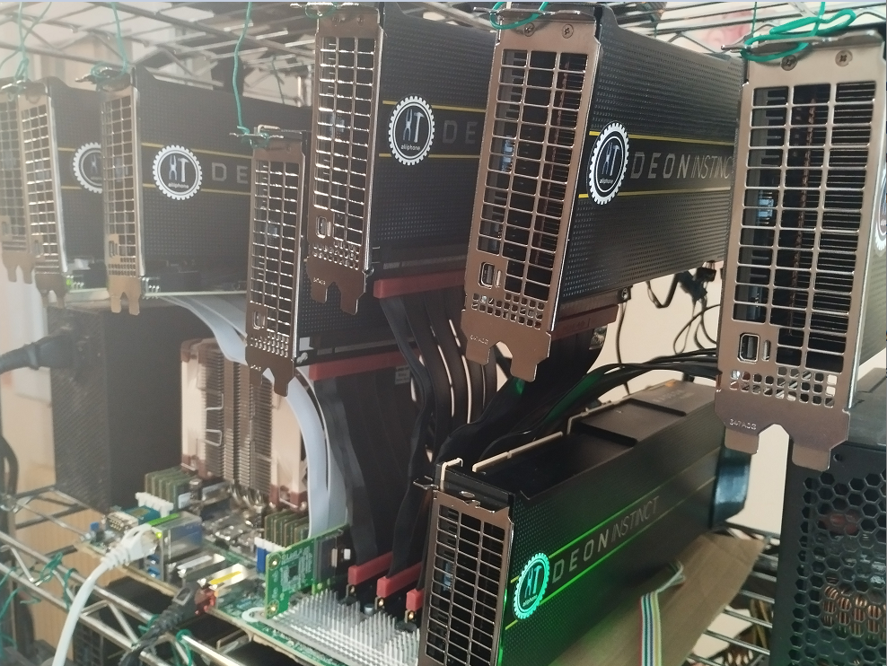

# Guidances for Test setup of 8 AMD MI50 32GB (MiniMax-M2.1 & GLM 4.7)



**Goal: reach production ready system for autonomous software development at minimal cost & maximal throughput+accuracy**

**GPUs cost**: 880$ for 256GB VRAM (early 2025 prices)

**Power draw**: 280W (idle) / 1200W (inference)

**Feel free to ask any questions and/or share any comments in the issues section here or in the medium article:** 
https://medium.com/@ai-infos/8x-amd-mi50-32gb-at-26-t-s-tg-with-minimax-m2-1-and-15-t-s-tg-with-glm-4-7-vllm-gfx906-2c38577ef98a


## Hardware details

- 8x AMD MI50 32GB (with 2 small fans 50mm per GPU at the back)
- Motherboard with 7 PCIe 4.0 ports x16 (ROMED8-2T)
- AMD EPYC CPU with 128 lanes (like 7642 with its 48 cores 2.3 GHz or other)
- 1x 64 GB ram DDR4 3200 ECC
- 2x PSU 1800W (with 1 add2psu)
- 5x LINKUP Ultra PCIe 4.0 x16 Risers
- 2x SlimSAS PCIe device adapters
- 2x SlimSAS cables 8i
- 1x SlimSAS PCIe host adapter
- 1 NVME drive

## Software details

- Ubuntu v24.04
- ROCM v6.3.4
- torch v2.9
- triton-gfx906 v3.5
- vllm-gfx906 v0.12.0 + patches from here
- MI50 bios: 32G_UEFI.rom (available there: https://gist.github.com/evilJazz/14a4c82a67f2c52a6bb5f9cea02f5e13 /!\ don't flash your bios if you don't know what you do; the stock bios might work in your setup)
- open-webui
- Visual Studio Code with relevant extensions: like Roo Code with relevant MCP servers (like Context7, sequentialthinking, tavily for websearch)

## Relevant commands to run


### ROCm & amdgpu drivers

```code
# Get the script that adds the AMD repo for 24.04 (noble)
wget https://repo.radeon.com/amdgpu-install/6.3.4/ubuntu/noble/amdgpu-install_6.3.60304-1_all.deb
sudo apt install ./amdgpu-install_6.3.60304-1_all.deb

# Install ROCm  6.3.4 including hip, rocblas, amdgpu-dkms etc (assuming the machine has already the advised compatible kernel 6.11)
sudo amdgpu-install --usecase=rocm --rocmrelease=6.3.4    

sudo usermod -aG render,video $USER

# Verify ROCm installation
rocm-smi --showproductname --showdriverversion
rocminfo


# Add iommu=pt if you later grow beyond two GPUs
# ROCm’s NCCL-/RCCL-based frameworks can hang on multi-GPU rigs unless the IOMMU is put in pass-through mode
# see https://rocm.docs.amd.com/projects/install-on-linux/en/docs-6.3.3/reference/install-faq.html#multi-gpu

sudo sed -i 's/GRUB_CMDLINE_LINUX_DEFAULT="/GRUB_CMDLINE_LINUX_DEFAULT="iommu=pt /' /etc/default/grub
sudo update-grub
sudo reboot
cat /proc/cmdline  # >>> to check: must return: "BOOT_IMAGE=... iommu=pt"

```

### vllm-gfx906 fork with its dependencies (torch, triton, python, etc)

```code

pyenv install 3.12.11
pyenv virtualenv 3.12.11 venv312
pyenv activate venv312

# TRITON

git clone --branch v3.5.0+gfx906 https://github.com/nlzy/triton-gfx906.git
cd triton-gfx906
pip install 'torch==2.9' torchvision torchaudio --index-url https://download.pytorch.org/whl/rocm6.3  
pip install -r python/requirements.txt
pip wheel --no-build-isolation -w dist . 2>&1 | tee build.log
pip install ./dist/triton-*.whl  


# VLLM

git clone --branch v0.12.0+gfx906 --single-branch https://github.com/nlzy/vllm-gfx906.git
cd vllm-gfx906
pip install 'cmake>=3.26.1,<4' 'packaging>=24.2' 'setuptools>=77.0.3,<80.0.0' 'setuptools-scm>=8' 'jinja2>=3.1.6' 'amdsmi>=6.3,<6.4' 'timm>=1.0.17'
pip install -r requirements/rocm.txt
pip wheel --no-build-isolation -v -w dist . 2>&1 | tee build.log
pip install ./dist/vllm-*.whl

```
### Download MiniMax-M2.1 AWQ (4-bit)

```code
mkdir -p ~/llm/models/MiniMax-M2.1-AWQ && cd ~/llm/models
pip install -U "huggingface_hub[cli]"
huggingface-cli download QuantTrio/MiniMax-M2.1-AWQ --local-dir ./MiniMax-M2.1-AWQ
```

### Run MiniMax-M2.1-AWQ in vllm-gfx906

**Copy the files from the patch here "vllm_gfx906_v0120_patch_minimax_m21" to your vllm installation repository (if pyenv used, the path would be something like ~/.pyenv/versions/3.12.11/envs/venv312/lib/python3.12/site-packages/vllm/)** 

```code
NCCL_P2P_DISABLE=1 VLLM_USE_TRITON_AWQ=1 OMP_NUM_THREADS=4 NCCL_DEBUG=INFO vllm serve \
    ~/llm/models/MiniMax-M2.1-AWQ \
    --served-model-name MiniMax-M2.1-AWQ \
    --enable-auto-tool-choice \
    --tool-call-parser minimax_m2 \
    --reasoning-parser minimax_m2_append_think \
    --swap-space 0 \
    --trust-remote-code \
    --max-model-len 196608 \
    --gpu-memory-utilization 0.95 \
    --tensor-parallel-size 8 2>&1 | tee log.txt
```

**Performance peak**: TG (token generation): **26.8 tok/s** / PP (prompt processing): variable according to request length (e.g. ~3000 tok/s for 30000 tokens input; in general, speed ~= tokens_input/10 tok/s)

### Download GLM 4.7 AWQ (4-bit)

```code
mkdir -p ~/llm/models/GLM-4.7-AWQ && cd ~/llm/models
pip install -U "huggingface_hub[cli]"
huggingface-cli download QuantTrio/GLM-4.7-AWQ --local-dir ./GLM-4.7-AWQ
```

### Run GLM 4.7 in vllm-gfx906

**Copy the files from the patch here "vllm_gfx906_v0120_patch_glm47" to your vllm installation repository (if pyenv used, the path would be something like ~/.pyenv/versions/3.12.11/envs/venv312/lib/python3.12/site-packages/vllm/)** 

```code
NCCL_P2P_DISABLE=1 VLLM_USE_TRITON_AWQ=1 OMP_NUM_THREADS=4 NCCL_DEBUG=INFO vllm serve \
  ~/llm/models/GLM-4.7-AWQ --gpu-memory-utilization 0.95 \
  --served-model-name GLM-4.7-AWQ \
  --speculative-config.method mtp \
  --speculative-config.num_speculative_tokens 1 \
  --tensor-parallel-size 8 --tool-call-parser glm47 --reasoning-parser glm45 \
  --enable-auto-tool-choice --max-model-len 95000 --swap-space 0 2>&1 | tee log.txt
```

**Performance peak**: TG (token generation): **15.6 tok/s** / PP (prompt processing): variable according to request length (e.g. ~3000 tok/s for 30000 tokens input; in general, speed ~= tokens_input/10 tok/s)

**Enjoy your most cost effective solution of the world for one of the best fast intelligent local inference setup (at the moment).**

### Run Open-WebUI

```code
sudo docker run -d --network=host \
  --name open-webui-mi50 \
  -v open-webui:/app/backend/data \
  -e OPENAI_API_BASE_URL=http://localhost:8000/v1 \
  --restart always \
  ghcr.io/open-webui/open-webui:main
```

Go to http://localhost:8080 and enjoy your favourite model locally!

## TODO LIST

- improve this guidance draft (content/form)
- add docker files for easy setup


**Credits: Global Open source Community**
